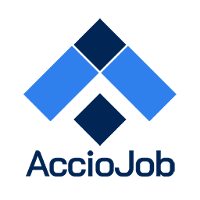
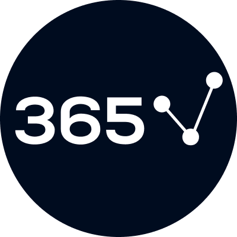

# Hello! I'm Raj 
 
## 📊 Data Analyst | Transforming Data into Business Value  

Welcome to my GitHub!  
I specialize in **turning raw data into clear insights and actionable strategies**.  I help organizations make smarter, data-driven decisions.

✨ Passionate about analytics. Curious about patterns. Driven by insights.  

---
### 🛠️ Skills & Tools 

- **Visualization:**  
   
   
    

- **Data Handling:**  
   
   
   
    

- **Programming:**  
   
   
    

- **Analytics:**  
   
    

- **Data Visualization Libraries:**  
   
    

---

### 📊 What I Do  

- 📈 Build interactive dashboards & reports for data-driven decisions.  
- 🔄 Automate data cleaning, transformation, and reporting processes.  
- 🔍 Analyze complex datasets to identify trends and actionable insights.  
- 🤝 Collaborate with teams to solve real-world business problems.  

---

### 🚀 Quick Facts  

- 💡 Passionate about making data meaningful and easy to understand.  
- 📚 Continuously learning new tools & techniques in analytics.  
- 🔎 Love exploring datasets and deriving stories from numbers.  

---

### 🏅 Certificates  

-  **Data Analytics (Power BI, SQL, Excel, Python)** – Accio Job  
-  **Power BI** – Udemy  
-  **C Programming** – NPTEL (IIT Kanpur)  
-  **Python (Pandas, NumPy)** – 365 Data Science  

---
### 🌐 Let’s Connect  

   &nbsp;&nbsp;&nbsp;&nbsp;
   &nbsp;&nbsp;&nbsp;&nbsp;
  

---
<!--
**rajvkr/rajvkr** is a ✨ special ✨ repository because its `README.md` (this file) appears on your GitHub profile.
-->
